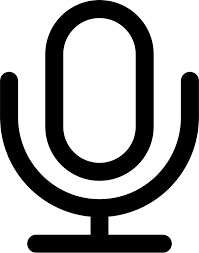

<!-- PROJECT SHIELDS -->
[![Contributors][contributors-shield]]() [![LinkedIn][linkedin-shield]][linkedin-url]


<!-- PROJECT LOGO -->
<br />
<p align="center">
  <a href="https://github.com/JawadAr/Pronunciation-verification-using-anomaly-detection-Thesis">
    
  </a>

  <h3 align="center">Pronunciation Verification using Anomaly Detection</h3>

  <p align="center">
    A MS thesis @ITU
    <br />
    <a href="https://itu.edu.pk">

<!-- TABLE OF CONTENTS -->
## Table of Contents

* [Abstract](#abstract)
  * [Frameworks](#frameworks)
* [Getting Started](#getting-started)
  * [Prerequisites](#prerequisites)
  * [Installation](#installation)
* [Usage](#usage)
* [Contributing](#contributing)
* [Contact](#contact)
* [Acknowledgements](#acknowledgements)


<!-- ABOUT THE PROJECT -->
## Abstract


The automatic evaluation of speech is a powerful tool in second language acquisition. Computer aided pronunciation training (CAPT) systems aim to automatically detect incorrectly pronounced words, and quantify the quality of the pronunciations - which arguably is one of the hardest tasks in speech processing domain. The lack of sufficient mispronunciation tagged data seriously impedes the accurate detection of incorrect pronunciations. To handle this problem, in this paper, we have used the approach of tackling phone-level pronunciation verification problem as an anomaly detection problem using two different techniques, representation learning and auto-encoder technique, in a semi-supervised learning set-up. The Representation leaning model uses a Deep Convolutional Neural Network (DCNN) to learn a rich set of discriminative features through a classification task, while the Auto-encoder model uses a Convolutional Neural Network-Deep Auto-encoder (CNN-DAE) architecture to learn to reconstruct the correct pronunciations with least error. Previously [2] has used the anomaly detection method on frame level with a hybrid model - a combination of deep and shallow architectures. The plus point of using a deep architecture as opposed to a shallow or a hybrid architecture is that we can train our models in an end to end fashion using a task specific loss function instead of using hand-crafted features or feature extractors before a shallow learner without a task specific loss function. Posing the pronunciation verification problem as an anomaly detection problem allows us to train our models using only the positive (correct) class. We have experimented with two different architectures and a number of combinations of different data-sets. We also contribute a force aligned data-set containing isolated speech from professional English speakers of the Cambridge dictionary [3], along with the results of our mispronunciation detection models on this data-set. We have achieved a F1-score of 75% on this data-set. For cross corpus evaluation, we have selected the challenging L2-Arctic corpus [4], and has achieved a F1-score of 24% using phone level processing and targeting all three types of pronunciation errors, which is near to the best frame level F1-score of 29% on this data-set with substitution errors only.

### Frameworks

* [Python](https://python.org)
* [Google Colab](google.com)
* [Jupyter Notebooks](https://jupyter.org/)


<!-- GETTING STARTED -->
## Getting Started

Each of the notebooks in the repository represent a stand-alone experiment. 

### Prerequisites

* Python 3.6 or higher
```sh
sudo apt-get python3
```
* jupyter notebook
```sh
pip install jupyter
```

### Installation

1. Clone the repo
```sh
git clone https:://github.com/your_username_/Project-Name.git
```
2. Install Python and Jupyter
```sh
sudo apt-get python3
```
4. Run the cells of the notebook


<!-- USAGE EXAMPLES -->
## Usage

Every notebook has been named as follows:

***experimentLevel_modelType_features_trainingSet_testSet***


<!-- CONTRIBUTING -->
## Contributing

Contributions are what make the open source community such an amazing place to be learn, inspire, and create. Any contributions you make are **greatly appreciated**.

1. Fork the Project
2. Create your Feature Branch (`git checkout -b feature/AmazingFeature`)
3. Commit your Changes (`git commit -m 'Add some AmazingFeature`)
4. Push to the Branch (`git push origin feature/AmazingFeature`)
5. Open a Pull Request


<!-- LICENSE -->
## References

[1] S. M. Witt et al., “Use of speech recognition in computer-assisted language learning,” 1999.  
[2] M. Shahin, B. Ahmed, J. X. Ji, and K. Ballard, “Anomaly detection approach for pronunciation verification of disordered speech using speech attribute features,” in Proc. Interspeech 2018, 2018, pp. 1671–1675. [Online]. Available: http://dx.doi.org/10.21437/Interspeech.2018-1319  
[3] “English dictionary, translations & thesaurus.” [Online]. Available: https://dictionary.  
cambridge.org/  
[4] G. Zhao, S. Sonsaat, A. Silpachai, I. Lucic, E. Chukharev-Hudilainen, J. Levis, and R. GutierrezOsuna, “L2-arctic: A non-native english speech corpus,” in Proc. Interspeech 2018, 2018, pp. 2783–2787. [Online]. Available: http://dx.doi.org/10.21437/Interspeech.2018-1110


<!-- CONTACT -->
## Contact

Jawad Arshad - jawad.arshad@itu.edu.pk

Project Link: [https://github.com/JawadAr/Pronunciation-verification-using-anomaly-detection-Thesis](https://github.com/JawadAr/Pronunciation-verification-using-anomaly-detection-Thesis)


<!-- ACKNOWLEDGEMENTS -->
## Acknowledgements

I am very thankful to Dr. Agha Ali for being very kind and supportive throughout my thesis.
I thank all the members of [CSaLT](http://csalt.itu.edu.pk/) for all the motivational and technical help, special thanks
to Haris Bin Zia - he was the goto guy for every problem I faced during the learning phases

* [GitHub Emoji Cheat Sheet](https://www.webpagefx.com/tools/emoji-cheat-sheet)
* [Img Shields](https://shields.io)
* [Choose an Open Source License](https://choosealicense.com)
* [GitHub Pages](https://pages.github.com)


<!-- MARKDOWN LINKS & IMAGES -->
[build-shield]: https://img.shields.io/badge/build-passing-brightgreen.svg?style=flat-square
[contributors-shield]: https://img.shields.io/badge/contributors-1-orange.svg?style=flat-square
[license-shield]: https://img.shields.io/badge/license-MIT-blue.svg?style=flat-square
[license-url]: https://choosealicense.com/licenses/mit
[linkedin-shield]: https://img.shields.io/badge/-LinkedIn-black.svg?style=flat-square&logo=linkedin&colorB=555
[linkedin-url]: https://www.linkedin.com/in/jawad-arshad-5b2438166/
[product-screenshot]: https://github.com/JawadAr/Pronunciation-verification-using-anomaly-detection-Thesis/blob/master/download.png
